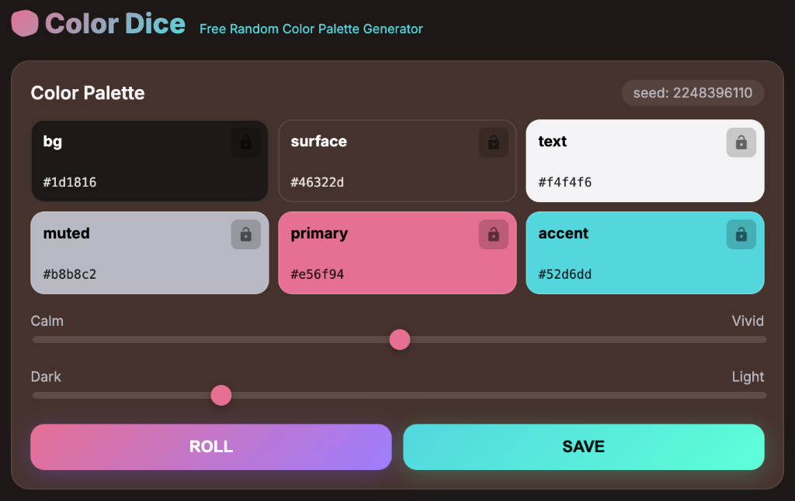
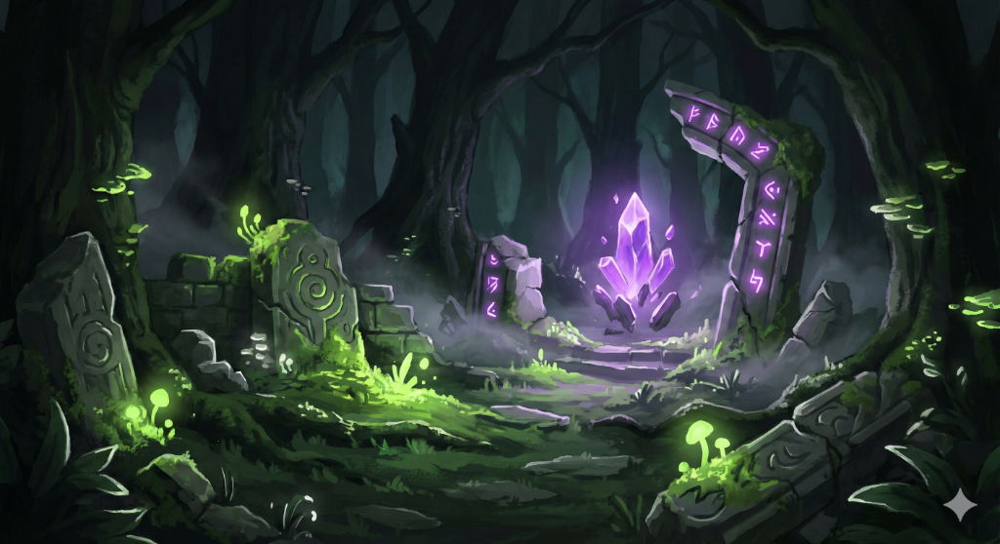
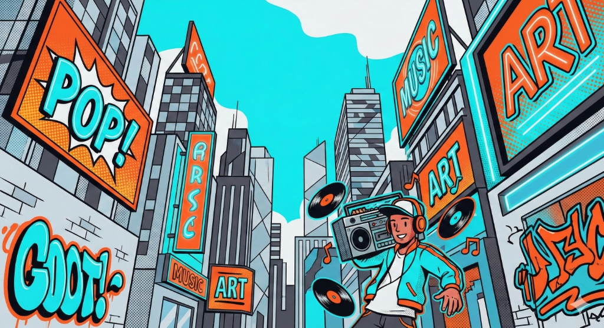

# 🎲 Color Dice

A free random color palette generator. Roll the dice and find your perfect theme!

**👉 [colordice.yo4e.com](https://colordice.yo4e.com)**



---

## Features

- **One-click generation** — Press ROLL or Space to generate palettes
- **Saturation slider** — Adjust from Calm to Vivid
- **Lightness slider** — Adjust from Dark to Light
- **Color locking** — Lock any color and regenerate the rest
- **Favorites** — Save up to 20 palettes (localStorage)
- **Export options** — CSS variables, HTML preview, or PNG image
- **Mobile sharing** — Web Share API for iOS/Android

---

## 💡 Pro Tip

Copy the CSS and paste it to AI image generators like Nano Banana — ask them to "generate an image using this color palette" for perfectly coordinated visuals!

### Examples

| Dark & Mysterious | Vivid & Pop |
|:---:|:---:|
|  |  |

---

## Tech Stack

- **Frontend**: HTML / CSS / JavaScript (single file, no build step)
- **Hosting**: Cloudflare Pages
- **Analytics**: Cloudflare Web Analytics
- **Sharing**: Web Share API (mobile)

---

## Getting Started

```bash
# Clone the repo
git clone https://github.com/yo4e/color-dice.git

# Open locally
open index.html
```

No dependencies. No build process. Just open and go.

---

## Browser Support

- Chrome 90+
- Firefox 90+
- Safari 13+
- Edge 90+
- iOS Safari 13+
- Android Chrome 90+

---

## License

© 2026 [月野テンプレクス](https://open.spotify.com/intl-ja/artist/2ywWnX3fORCEVpUZYQ6dIA) / KazeX Records
